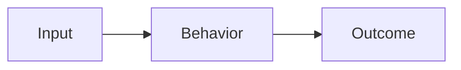

# Tên technical concept

<!--
Ngôn ngữ chính của phần giải thích là tiếng Việt. Giữ nguyên những technical term
tiếng Anh mà software engineer thường sử dụng. Explain locally, link when learned:
giải thích term đủ để note tự hiểu được; chỉ link tới learning note thực sự đã tồn
tại và cung cấp thêm understanding. Không tạo note cho concept chưa học chỉ để có
link. Không dịch code, API, class, configuration, command, filename, protocol hoặc
identifier. Giữ nguyên các section
heading tiếng Anh bên dưới để toàn bộ knowledge base nhất quán.

Markdown first: chỉ dùng Mermaid, Docusaurus admonition, table hoặc JSX khi chúng
thực sự làm concept dễ hiểu và dễ scan hơn. Không bắt buộc article phải có các yếu
tố này. Không dùng text code block thay cho diagram; không tạo React component chỉ
vì file có định dạng MDX.
-->

## TL;DR

Tóm tắt takeaway quan trọng nhất trong hai hoặc ba câu. Nêu concept là gì và vì sao nó quan trọng.

## Mental Model

Giải thích mental model đơn giản nhất để concept trở nên trực quan. Kết nối input, behavior và outcome. Cân nhắc Mermaid khi flow, architecture, lifecycle, sequence hoặc relationships trở nên dễ hiểu hơn qua diagram.

<!-- Optional, remove when a diagram does not materially improve understanding.

-->

## Core Concepts

- **Concept:** Định nghĩa đủ ngữ cảnh ngay tại đây và giải thích vì sao nó quan trọng. Với term đơn giản, một hoặc hai câu là đủ.
- **Learned related concept:** Tóm tắt ngắn để note vẫn tự hiểu được, rồi thêm internal link tới canonical learning note nếu link cung cấp understanding sâu hơn.
- **Unlearned supporting concept:** Chỉ giải thích mức tối thiểu cần cho topic hiện tại; không tạo article hoặc progress entry chỉ để có link.

## Example

Đưa ra một ví dụ nhỏ và cụ thể. Ưu tiên executable code, sample data hoặc scenario thực tế thể hiện được mental model.

```ts
// Minimal example; keep code and identifiers in their original language.
```

## When to Use

- Tình huống phù hợp với approach này.
- Signal cho thấy nên chọn nó.
- Trade-off có thể khiến approach khác phù hợp hơn.

<!-- Optional: dùng :::tip cho practical takeaway hoặc best practice nổi bật. -->

## Common Mistakes

- **Mistake:** Giải thích vì sao lỗi này xảy ra và cách tránh hoặc phát hiện nó.

<!-- Optional: dùng :::warning khi một misconception hoặc risk cần được nhấn mạnh. -->

## My Understanding

<!-- Personal learning state: agents must preserve existing owner-authored text. -->

Diễn đạt lại concept bằng lời của bạn. Ghi lại điều vẫn chưa chắc chắn hoặc sự thay đổi trong cách bạn hiểu nó.

## My Experiment

<!-- Personal learning state: agents must preserve experiment history and results. -->

**Status:** Planned / In progress / Complete

**Hypothesis:** Tôi kỳ vọng điều gì, và vì sao?

**Setup:** Tôi sẽ xây dựng gì, giữ yếu tố nào cố định và đo lường gì?

**Result:** Điều gì đã xảy ra?

**Conclusion:** Điều gì đã thay đổi trong understanding của tôi?

## Related Knowledge

<!--
Chỉ link tới learning note thực sự đã tồn tại. Chọn quan hệ có ý nghĩa, giải thích
mối liên hệ sau mỗi link và thêm reciprocal link khi hữu ích. Nếu chưa có related
note đã học, nói rõ khoảng trống thay vì để placeholder hoặc tạo knowledge giả.

Example khi target thực sự tồn tại:
- [Related note đã học](../category/related-note.mdx) — giải thích mối liên hệ và giá trị understanding bổ sung của target note.
-->

## Self-test

1. Câu hỏi kiểm tra recall?
2. Câu hỏi kiểm tra khả năng giải thích mental model?
3. Câu hỏi kiểm tra khả năng áp dụng trong scenario mới?
4. Trade-off nào sẽ làm thay đổi quyết định?

<details>
<summary>Answers</summary>

1. Câu trả lời.
2. Câu trả lời.
3. Câu trả lời.
4. Câu trả lời.

</details>
