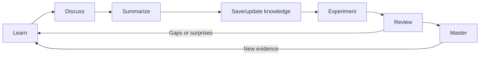

# Learning Workflow

## TL;DR

Use a deliberate loop to turn exposure into usable knowledge:

**Learn → Discuss → Summarize → Save/update knowledge → Experiment → Review → Master**

The knowledge base is not the end of the process. A note records the current state of understanding so discussion, practice, and review can improve it over time.

## Mental Model

Think of learning as a feedback loop rather than a one-way reading pipeline. Each pass converts information into a clearer model, tests that model against reality, and feeds the result back into the canonical note.

“Master” means the idea can be recalled, explained, applied, and adapted—not that the note can never change.

## Core Concepts

- **Learn:** Gather a focused source, question, observation, or problem instead of consuming broadly without an objective.
- **Discuss:** Challenge the idea through questions, counterexamples, comparisons, and explanation in plain language.
- **Summarize:** Compress the discussion into a mental model and the smallest set of concepts needed to reconstruct it.
- **Save/update knowledge:** Search for the canonical note, then improve it or create a distinct note using the standard structure.
- **Experiment:** Turn an uncertain claim into a hypothesis, setup, observation, and conclusion.
- **Review:** Use self-test questions and experiment results to expose gaps, stale beliefs, and weak links.
- **Master:** Demonstrate recall, explanation, application, and judgment across unfamiliar situations.

## Example

After learning about context windows, first discuss why larger windows do not automatically produce better answers. Summarize the signal-to-noise mental model, then search the knowledge base and update [Context Engineering](../ai-coding/context-engineering.md) instead of creating a duplicate “Context Windows” note.

Next, compare two coding sessions using full-repository and task-selected context. Record the result in `My Experiment`, review the self-test later without looking at the answers, and refine the note with what the experiment revealed.

## When to Use

- When encountering a new AI Engineering concept or technique.
- When a discussion changes an existing belief.
- When implementation results conflict with documentation or intuition.
- When reviewing older notes for retention or relevance.
- When deciding whether new information deserves a new article.

## Common Mistakes

- **Saving too early:** Copying source material before discussing it creates notes without personal understanding.
- **Creating instead of searching:** A new page may fragment a concept that already has a canonical home.
- **Stopping after summarizing:** Untested summaries can preserve plausible but incorrect beliefs.
- **Polishing away uncertainty:** Open questions and failed experiments show where learning should continue.
- **Treating mastery as permanent:** AI Engineering changes, and even strong mental models need review against new evidence.

## My Understanding

The repository should capture the output of learning, not substitute for learning. A useful note is a checkpoint in an active loop: it makes my current model explicit, gives me something testable, and helps future reviews begin from accumulated evidence rather than from scratch.

## My Experiment

**Status:** Planned

**Hypothesis:** Following the complete workflow for one topic will produce better delayed recall and more practical confidence than writing a summary immediately after reading.

**Setup:** Choose two concepts of similar difficulty. Process one through all seven stages and summarize the other without discussion or experimentation. After one week, compare recall, explanation quality, and performance on a novel task.

**Result:** Not run yet.

**Conclusion:** Record which stages produced observable value and adjust the workflow without removing the feedback loop.

## Related Knowledge

- [Context Engineering](../ai-coding/context-engineering.md) — demonstrates how discussion and experimentation can deepen an existing canonical note.

## Self-test

1. What are the seven stages of the workflow, in order?
2. Why is saving or updating knowledge placed before experimentation?
3. What should happen when new learning overlaps an existing note?
4. What evidence demonstrates mastery beyond recall?

Answers

1. Learn, Discuss, Summarize, Save/update knowledge, Experiment, Review, Master.
2. Writing the current model makes the experiment's assumptions explicit and gives its results a canonical place to update.
3. Improve the canonical note unless the new material has a genuinely distinct mental model or practical purpose.
4. The learner can explain, apply, and adapt the concept in unfamiliar situations and revise it when evidence disagrees.

