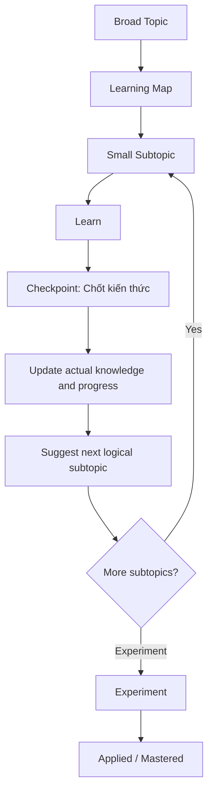

# Learning Workflow

This is system documentation for maintaining the knowledge base. It is not a learned-knowledge article and does not count toward the knowledge total.

The repository separates plans from evidence:

- **Learning Map = what is planned to learn:** a concise syllabus of the important subtopics within a broad topic. It guides the learning journey but is not learned knowledge.
- **Learning Progress = what has actually been learned:** `/docs` contains canonical notes produced from actual learning sessions, while `learning-progress.yaml` records their evidence-based state, confidence, reviews, experiments, prerequisites, and relationships.

An absent topic in `learning-progress.yaml` means it has not been learned yet. Never pre-populate the index with planned subtopics from a Learning Map.

:::info[Important distinction]

Learning Map describes intent; Learning Progress records evidence. A planned subtopic must not appear in `learning-progress.yaml` until an actual learning checkpoint produces a real note.

:::

## Workflow

1. **Broad Topic:** Start from the broad area the learner wants or needs to understand.
2. **Learning Map:** Present a concise syllabus of the important subtopics. Do not treat this plan as evidence or record its items in `learning-progress.yaml`.
3. **Small Subtopic:** Recommend one manageable, logical next subtopic rather than attempting the whole map at once.
4. **Learn:** Use an actual source, question, observation, discussion, or problem. Explore the learner's interpretations, counterexamples, and uncertainty.
5. **Checkpoint — “Chốt kiến thức”:** Confirm the takeaway and mental model for only the material covered. This checkpoint does not automatically complete the broad topic.
6. **Update actual knowledge/progress:** Search existing notes first. Update the canonical note when appropriate; otherwise create one from the learning-note template. Synchronize `learning-progress.yaml` using only demonstrated evidence.
7. **Suggest next logical subtopic:** Prefer continuing within the same active broad topic. Move to another broad topic only when the current one has sufficient evidence or a prerequisite detour is necessary.
8. **Repeat:** Work through the Learning Map in small learning and checkpoint cycles. If taking a prerequisite detour, make it explicit and return when appropriate.
9. **Experiment:** Record an experiment only when it is genuinely proposed or performed. Never fabricate setup, observations, or results.
10. **Applied/Mastered:** Advance status only when application or mastery is demonstrated through evidence such as recall, explanation, experiments, independent use, and judgment.

## Checkpoint behavior

After “Chốt kiến thức,” the tutor or agent should:

- Capture only what the learner actually learned in that checkpoint.
- Preserve gaps, uncertainty, and unfinished subtopics.
- Update progress without promoting the entire broad topic automatically.
- Recommend the next logical small subtopic in the active Learning Map.

:::warning[Evidence boundary]

Do not promote status or confidence because a syllabus item exists or a note looks complete. Progress changes require evidence from the learner's understanding, self-test, review, experiment, or demonstrated application.

:::
